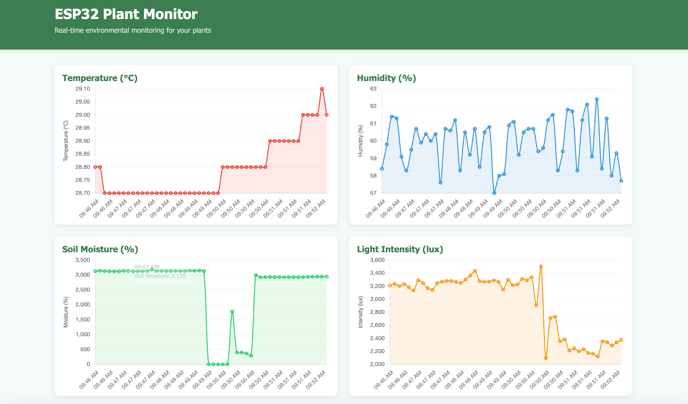
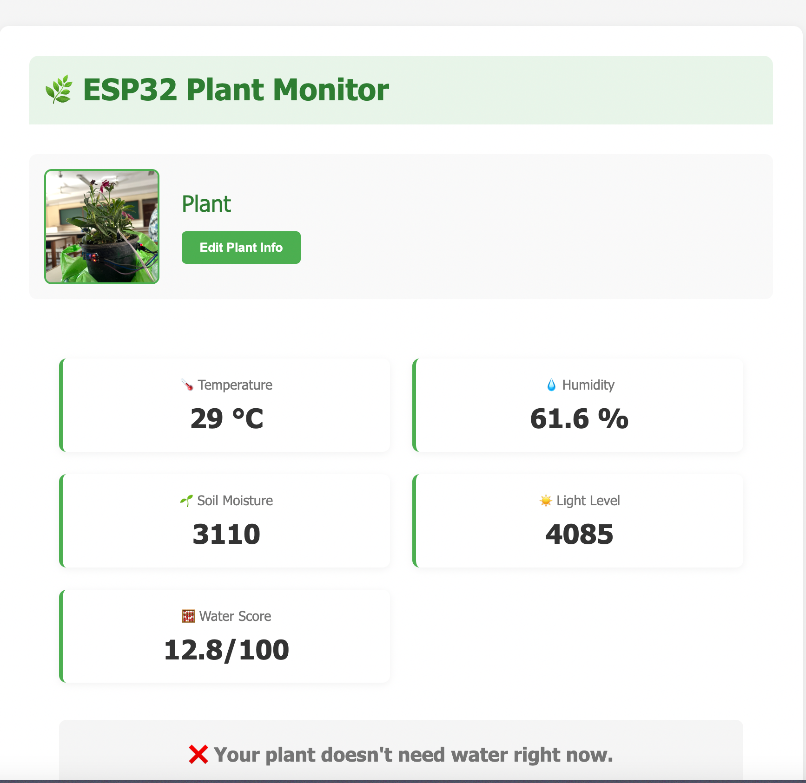

# 🌿 Smart Plant Monitoring System - ESP32 + Web Dashboard

This project is a smart plant monitoring system using an ESP32 board that reads sensor data and controls a water pump automatically. It also sends the data to a backend server, where it is stored in MongoDB and visualized through a responsive web dashboard with analytics.

---

## 📦 Components Used

- ESP32 Development Board  
- DHT11 (Temperature & Humidity Sensor)  
- Soil Moisture Sensor (Analog)  
- LDR (Light Dependent Resistor)  
- Relay Module  
- Submersible Water Pump  
- Wi-Fi Connection  

---

## 🧠 How It Works

### ✅ Features

- Reads temperature, humidity, soil moisture, and light intensity.
- Calculates a **plant health score** from sensor data.
- Automatically controls the water pump based on this score.
- Sends the data to a remote server via an HTTP POST request.
- Stores data in **MongoDB** for analysis and tracking.
- Displays real-time data and analytics through a **web dashboard**.

---

## 📜 Algorithm

1. **Initialization**:
   - Start serial communication at 115200 baud.
   - Initialize DHT sensor and GPIO pins.
   - Connect to Wi-Fi using provided credentials.

2. **Sensor Readings**:
   - Read:
     - Temperature & Humidity from DHT11.
     - Soil moisture from an analog pin.
     - Light level from an LDR connected to an analog pin.

3. **Data Normalization**:
   - Convert sensor values to a 0–100 score using `map()` and `constrain()`:
     - Soil Score: `map(soilValue, 1000, 3000, 0, 100)`
     - Temp Score: `map(temp, 25, 40, 0, 100)`
     - Humidity Score: `map(hum, 80, 30, 0, 100)`
     - Light Score: `map(ldrValue, 0, 3000, 0, 100)`

4. **Health Score Calculation**:
   ```cpp
   finalScore = soilScore * 0.4 + tempScore * 0.2 + humScore * 0.2 + ldrScore * 0.2;
   ```

5. **Relay & Pump Control**:
   - If `finalScore > 50`, turn **ON** the water pump (`RELAY LOW`).
   - Otherwise, turn **OFF** the pump (`RELAY HIGH`).

6. **Data Transmission**:
   - Format data into a JSON object:
     ```json
     {
       "temperature": "28.5",
       "humidity": "60.2",
       "soil": "2800",
       "light": "3000",
       "score": "67.4"
     }
     ```
   - Send this JSON to the server using an HTTP POST request.

7. **Delay**:
   - Wait for 5 seconds before repeating the loop.

---

## 📡 Server Endpoint

Make sure your server is running at the following address to receive the data:

```
http://{your_ip:3000}/api/data
```

---

## 🌐 Web Dashboard

A dedicated web dashboard is included to view and analyze plant data:

### 🔍 Features

- **Live Data Feed** from ESP32 sensors
- **Data History & Trends** stored in MongoDB
- **Analytics with Graphs** to monitor changes over time
- **Responsive UI** for mobile and desktop access

### 🖼️ Screenshots (Add your screenshots here)


**🔹 Analytics and Graphs**  


**🔹 Responsive Web Interface**  


---

## 🛠️ Technologies Used

- **ESP32** – Microcontroller for data collection and control  
- **MongoDB** – Stores sensor data for long-term tracking  
- **Express.js / Node.js** – REST API backend to receive data  
- **React.js** – Frontend framework for dashboard  
- **Chart.js / D3.js** – Data visualization libraries  
- **HTTPClient Library** – For sending HTTP POST requests from ESP32  

---

## 🔐 Authentication (Optional)

You can add user authentication to the dashboard for private access and user-based plant data tracking.

---

## 💡 Notes

- Adjust the `map()` ranges if you're using different sensor models or getting inconsistent values.
- Modify the weight distribution or threshold in the final score formula to suit your specific plant’s environmental needs.
- The relay control logic assumes `LOW = ON` and `HIGH = OFF` for the pump. Reverse if your relay works differently.

---

## 📬 Contact / Contributions

Feel free to raise issues, suggest improvements, or contribute to the project!
